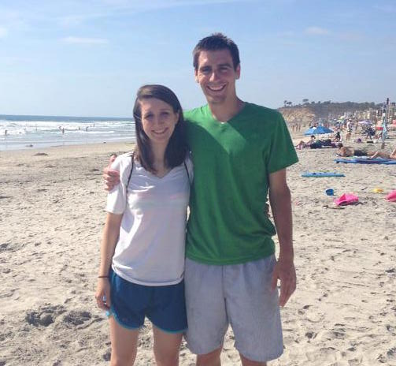
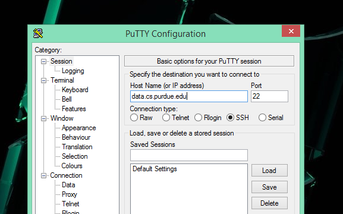
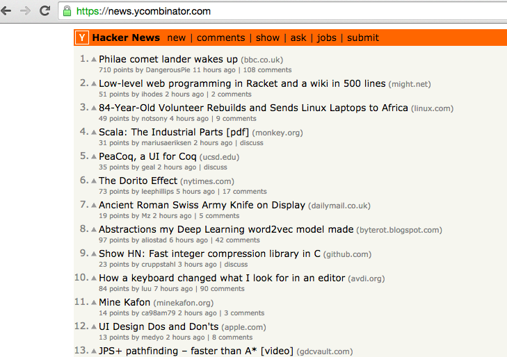

class: middle, title-slide

# CS 190

---

class: middle, title-slide

# History

---

## History - Tyler Hoffman

.center[  ]

---

## History - Today

Tools

- Navigating the Terminal
- Shell configurations
- Editors
- Debugging
- Source control
- Many more!!

---

## History - Today

Instructors
- Levi, Evan, and Spencer
- Awesome TAs

---

## History - USB

Computer Science Undergraduate Student Board

- This class!
- BoilerMake
- Help room
    - Mon-Thurs 7-9p
    - LWSN B131
- More?
    - Let us know! - usb@cs.purdue.edu
    - cs.purdue.edu/usb

---

class: middle, title-slide

# Quiz

---

## Quiz 1.1

_How would you describe your comfort level in CS?_

__A.__ Not very comfortable  

__B.__ Pretty comfortable  

__C.__ Somewhere in between

---

class: middle, title-slide

# Syllabus

---

## Requirements

- Lecture each week
    - Tuesday 3:30p CL50 224
    - iClicker attendence will be taken each week
- Labs each week
    - Turn in lab at end of class
- May not miss more than 3 labs or lectures (combined)

For further questions/concerns contact:  
cs190-tools-ta@cs.purdue.edu

---

class: middle, title-slide

# Questions?
### Ask anything

---

class: middle, title-slide

# CS190 Lecture 1
### Using the `>terminal`

---

class: middle, title-slide

# Why?
### It's useful, It's rewarding, It's fun

---

## Why should I learn the terminal?

* Keyboard > mouse
    * File maniplulation can be done in single commands
    * Repeat and automate tedious tasks easily
    * Terminal commands are universal to many OSs
* It's what professionals use
* Often it's all you have access to
* You're expected to know it

---

class: middle, title-slide

# Accessing a Purdue server

---

## Using a Purdue server (Mac/Linux)

* Already runs a unix system!
* Open your terminal app

```bash
# Use ssh!
# ssh <username@machine>.cs.purdue.edu

ssh lpstarre@data.cs.purdue.edu
```

---

## Using a Purdue server (Windows)

* Doesn't run unix :(
* Install and open PuTTY

.center[  ]

---

## What the heck is the terminal?

* An interface between the user and the computer
    * Has text output
    * Uses the keyboard for input
    * Sometimes called a TTY
* Runs programs
    * Editors, debuggers, interpreters (e.g. Python, Ruby)
    * Shells!

---

## Shells

* Most terminals run a shell by default
* What is a shell?
    * A program!
    * Allows you to interact with the OS
    * Can access the filesystem, read and write files, and execute programs
* We use a shell called BASH (there are many others like ZSH)

---

## History and terminology

* UNIX
    * Operating system developed by AT&T at Bell Labs in the 1970s
    * Inspired many similar operating systems like Linux, Solaris, BSD, Darwin, etc.
* POSIX
    * Set of standards to unify operating systems
    * Specified by IEEE

---

## History and terminology

* BASH
    * Developed in the late 1980s by the Free Software Foundation to replace the Bourne shell
    * Default shell on many systems including most Linux distributions and OS X
---

## Environment

Every program has an environment. This includes variables such as

* Which user is running the program
* In which directory is the program being run
* etc.

### _Shells have an environment too!_

---

class: middle, title-slide

# Using BASH
### Navigating the shell

---

## pwd - print working directory

```bash
# print working directory
pwd

# output
/homes/lpstarre/cs190/lab1

# note: pwd is just a program! When you type the command 'pwd',
# bash looks up the program by that name and executes it.
# In this case, pwd accesses the environment to find what the
# current directory is.
```

---

## ls - list directory contents

```bash
# list the contents of the current working directory
ls

# list the contents of a specific directory
ls /homes/lpstarre/cs190

# list contents including hidden files
ls -a
```

---

## ls - list directory contents (cont.)

```bash
# list in long format (more details about files)
ls -l

# list with most recently modified files first
ls -t

# combine option flags
ls -alt
```

---

## cd - change directory

```bash
# navigate into a directory
# cd <directory>
cd /homes/lpstarre/cs190

# navigate to the parent directory of the current
# working directory
cd ..
```

---

## cd - change directory (cont.)

```bash
# navigate to the current user's home directory
cd

# navigate to the previously accessed directory
cd -
```

---

class: middle, title-slide

# Using BASH
### Manipulating files and folders

---

## mv move/rename files

```bash
# move a file or directory
mv file.txt /new/location/
mv folder /new/location/

# rename a file or directory
mv oldname.txt newname.txt

# combining the two
mv file.txt /new/location/file.txt
```

---

## cp - copy files and directories

```bash
# copy a file
cp file.txt filecopy.txt

# copy a directory
cp -r folder foldercopy

# note: the -r flag tells the copy program to recursively
# copy the directory and all it's subdirectories and files
```

---

## rm - remove files or directories

```bash
# remove a file
rm file.txt
rm /path/to/file.txt

# remove a directory
rm -r folder
rm -r /path/to/folder
```

---

## mkdir - make directories

```bash
# make a directory
mkdir newfolder

# make a directory and all necessary parent
# directories. The folders cs190/labs will be
# created if they don't already exist.
mkdir -p cs190/labs/lab2
```

---

class: middle, title-slide

# Using BASH
### File path tips

---

## * - wildcard

```bash
# move all files in /folder into /another_folder
mv /folder/* /another_folder

# copy all files beginning with "cs" into /folder
cp cs* /folder

# remove all files ending in .txt
rm *.txt
```

---

## .. . - parent and working directory

```bash
# .. = parent directory
# .  = current working directory
# navigate to the parent directory of the current working
# directory
cd ..

# move file.txt from the parent directory into the
# current working directory
mv ../file.txt .
```

---

## ~ - current user's home directory

```bash
# navigate to the home directory of the current user
cd ~

# move the folder "project1" into the folder "cs180" which
# is located at the root of the user's home directory
mv project1 ~/cs180
```

---

## / - filesystem root

```bash
# / represents the root of the OS filesystem. Typically
# it contains all of the files essential for the operating
# system to run and is read only.

# navigate to the root of the filesystem
cd /

# the point: avoid prepending your paths with /
# "cd /cs180" IS NOT THE SAME AS "cd cs180"
```

---

## \ - escape character

```bash
# Often times, we have special characters in shells. For
# example, the space character separates arguments.
# The following command will move file1 and file1 into folder1.
mv file1 file2 folder1
```

---

## \ - escape character

```bash
# However, sometimes we want to have spaces in our file
# names. The following command will move the file
# "levi starrett" into folder1. The escape character indicates
# that the space should be taken as a normal character
mv levi\ starrett folder1

# or
mv "levi starrett" folder1
```

---

## A word about file extensions

File extensions serve one main purpose:
### _to differentiate different file types_

When the computer sees _.txt_, it assumes the file is plain text and will
open it with a text editor. When it sees _.html_ it will open the file with
a browser, and when it sees _.png_ it will open the file with an image viewer

---

## A word about file extensions

### The catch:
* **_A file's contents are never guaranteed to match its extension._**
* **_A file does not need an extension_**

---

class: middle, title-slide

# Wrap up

---

## Wrap up

Learned how to:

--

* Navigate a shell

--

* Manipulate files and folders

--

* Use path shortcuts

---

class: middle, title-slide

# Questions?
### Ask anything...

---

class: middle, title-slide
# Quiz

---

## Quiz 1.2

Which command would move all .txt files from two directories up to my
home directory?

__A.__    `mv ../../*.txt ~`

__B.__    `mv ../*.txt ~`

__C.__    `mv /../*.txt ~`

__D.__    `mv ~ ../*.txt`

---

class: middle, title-slide

# Something fun...

---

## Hacker News

### https://news.ycombinator.com

.center[  ]

---

class: middle, title-slide

# See you later!
