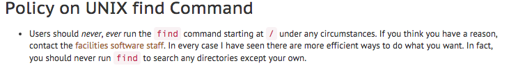

class: middle, title-slide

# Hello again...

---

class: middle, title-slide

# iClicker time!

---

## Quiz 2.1

_What do `.` and `..` represent in BASH shell? (order matters)_

__A.__ The parent and current directories

__B.__ The current and parent directories

__C.__ The current and system root directories

__D.__ The user's home directory and the current directory

---

## Quiz 2.1

_What do `.` and `..` represent in BASH shell? (order matters)_

__A.__ The parent and current directories

.highlight[__B.__ The current and parent directories]

__C.__ The current and system root directories

__D.__ The user's home directory and the current directory

---

## Remember...

- Help room
    - Mon-Thurs 7-9p
    - LWSN B131
- cs190-tools-ta@cs.purdue.edu

---

class: middle, title-slide

# CS190 Lecture 2
### More `>terminal`

---

class: middle, title-slide

# Tips/Review

---

## Tips/Review

* A terminal is an interface between the user and the computer
* It runs programs
* A shell is a program we use to interact with the OS
* BASH is the shell we use on the CS computers

---

## Tips/Review - Tab completion

```bash
# tab completion

drjava MyCla<tab>

# completes to

drjava MyClass.java

# can tab through options
```

---

## Tips/Review - History

```bash
# History one by one

<up-arrow>

# history command
history


# outputs previous commands and number
# 1015  drjava MyClass.java
# 1016  ls
```

---

## Tips/Review - History

```bash
# outputs previous commands and number
# 1015  drjava MyClass.java
# 1016  ls

# to execute command 1015
!1015

# or
!drjava
```

---

class: middle, title-slide

# Using BASH
### Input/output redirection

---

## Standard input (stdin)

The __standard input__ is the default input to a program.

When you type on your keyboard in the terminal window, you are feeding the standard input stream.

You can use a __Scanner__ in Java to read from __standard input__.

---

## Standard output (stdout)

The __standard output__ is the default input to a program.

When using a shell, standard output is ususally the terminal window. When characters are sent to 
standard output, they show up in the terminal.

You can use __System.out.print__ in Java to print characters to __standard output__.

---

## Redirecting stdin

```bash
# redirect standard input from the terminal to a file
# program < input_file

# feed the program with contents from the file geo_input.txt
java PlaneGeometry < geo_input.txt

# search the contents of my_story for the term "The End"
grep -n "The End" < my_story
```

---

## Redirecting stdout

```bash
# redirect standard output from the terminal to a file
# program > output_file

# send output of a Java program to output.txt
java Hello > output.txt

# save the output of ls in dir_info
ls > dir_info
```
---

## Combine redirects

```bash
# combine both standard input and standard output redirection
# program < input_file > output_file

# Scanner will get everything from geo_input.txt
# System.out.print will send everything to output.txt
java PlaneGeometry < geo_input.txt > output.txt

# whoa...
```
---

## Pipes

A pipe connects the output of one command to the input of the next.

Represented by symbol '|'

```bash
# connect two programs
cat hello.txt | wc -l

# can chain more than two commands
cat names.txt | grep -r John | java RegisterStudents
```

---

class: middle, title-slide

# Using BASH
### Searching

---

## find - locate a file

The __find__ command will search a folder and _ALL_ its subdirectories.

__Example:__ Judy searches her home folder for a file

__Result:__ _find_ will search in her home folder, her Desktop folder, her cs180 folder, her Projects
folder within her cs180 folder ... until it has checked every directory and file for the pattern.

---

## The dangers of find

Never, _ever_ run the __find__ command starting at the system root directory (the / directory)

.center[  ]

---

## find - locate a file

```bash
# allowed
find ~/ -name Shape.java
 
# allowed if your current working directory is at or within your home directory
find . -name Shape.java
  
# allowed if myfolder is at or within your home dir
find cs180/ -name Shape.java
```

---

## find - locate a file

```bash
# not allowed because it starts the search at the / directory

# DON'T NOT EVER RUN THIS!!
find / -name Shape.java
# DON'T NOT EVER RUN THIS!!
```

---

## find - locate a file

```bash
# find a file within my cs190lab1 folder or below named dogbark
find ~/cs190lab1 -name "dog_bark"
 
# find all files within my cs190lab1 folder or below starting with 'dog_'
 find ~/cs190lab1 -name "dog_*"
```

---

## find - locate a file

```bash
# find all .class files in my cs180/ directory or below and delete them
find ~/cs180 -name "*.class" -exec rm {} \;


# rm is the command to apply to each file found.
# The {}'s are a placeholder for each file that the find command locates
# The \; is the end of the -exec command
```

---

## grep - file pattern searcher

```bash
# Instructions
# grep "<search term>" <files_to_search>
 
# Options
# -n : show line number of occurrence
# -i : case-insensitive search
# -w : match whole word  
# -r : search recursively in sub-folders
```

---

## grep - file pattern searcher

```bash
# search within files of the project5 folder for occurrences of the text "main"
grep -n "main" ~/cs180/projects/project5/*
 
# search all files in ~/cs180 and its subfolders for the whole word "ShapeFactory"
grep -nrw "ShapeFactory" ~/cs180/
```

---

class: middle, title-slide

# Using BASH
### Accessing the internet

---

## wget - network downloader

```bash
# Instructions
# wget <website>

# download page of website
wget http://kirbyk.me
 
# download entire website (use with caution)
wget -r http://kirbyk.me
```

---

class: middle, title-slide

# Using BASH
### Working with text

---

## wc - word, line, character count

```bash
# Print the number of lines, words, and characters of file
wc book.txt
 
# Print the number of lines, words, and characters from standard input
cat book.txt | wc
```

---

## sort - sort lines of text files

```bash
# Sort a text file and overwrite the same file
sort student_list.txt > student_list.txt
 
# list contents of directory and sort the output and save to file
ls -al | sort > output.txt
```

---

## Quiz 2.2

_What command am I (Levi Starrett) __NOT ALLOWED__ to run on lab machines according
to the CS department?_

__A.__ `find ~/cs180/ -name Shape.java`

__B.__ `find ~/ -name Shape.java`

__C.__ `find /homes/kkohlmor -name Shape.java`

__D.__ `find / -name Shape.java`

---

## Quiz 2.2

_What command am I (Levi Starrett) __NOT ALLOWED__ to run on lab machines according
to the CS department?_

__A.__ `find ~/cs180/ -name Shape.java`

__B.__ `find ~/ -name Shape.java`

__C.__ `find /homes/kkohlmor -name Shape.java`

.highlight[__D.__ `find / -name Shape.java`]

---

class: middle, title-slide

# See you later!
