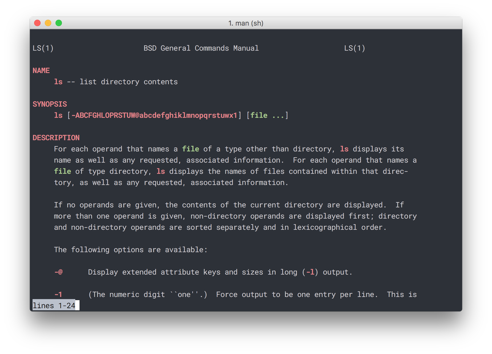

# ＬＥＣＴＵＲＥ 3: <!-- .element: style="background-color: pink; font-weight: bold; color: white; font-style:italic; text-align: center;"-->
## ＹＯＵＲ ＥＮＶＩＲＯＮＭＥＮＴ<!-- .element: style="background-color: pink; font-weight: bold; color: white; font-style:italic; text-align: center"-->
<!-- .slide: data-background-image="assets/wave.jpg" -->


# First, some review <!-- .element: style="text-align: center"-->


## Quiz 3.1
What does the command `ls > file.txt` do?

A. inputs the contents of `file.txt` into the program `ls`

B. appends the output of `ls` to `file.txt`

C. writes the output of `ls` to `file.txt`

D. nothing

E. it causes an error


## Quiz 3.1 Answer
What does the command `ls > file.txt` do?

** C. writes the output of `ls` to `file.txt`. **


## Reminder...

| symbol | what it does                                    |
| ------ | ----------------------------------------------- |
| `>`    | change stdout (output)                          |
| `<`    | change stdin (input)                            |
| &#124; | feed output of one command to input of another. |


# More Terminal Commands <!-- .element: style="text-align: center"-->


## `which`
```
# use which to find the location of a program or alias
~ » which ls
/bin/ls

# find where wget is located
~ » which wget
/usr/bin/wget

~ » which bash
/usr/local/bin/bash
```
<!-- .element: class="hljs nohighlight"-->


## `man`
Displays manual pages inside the terminal
`~ » man ls`

 <!-- .element: class="center" style="width: 70%; border: none; box-shadow:none;"-->


## Environment Variables
* Temporary variables used by the shell.
* Delete all and refreshes after terminal is closed.
* Environment is set up by dotfiles and system.
* Access variables in the shell with the **`$`** sign.


## Environment Variables
```
# assign a variable
~ » CURR_CLASS="cs190"  

# print value of variable
~ » echo $CURR_CLASS   
cs190

# prints all environment vars (including shell local variables)
~ » set                       
```
<!-- .element: class="hljs nohighlight"-->


## backticks
- allows you to run a command within another
- useful for assigning variables

```
# assign FILES to the result of the find command
~ » FILES=`find . -name "Shape.java"`

# remove all files that are listed in this .txt file
~ » rm `cat list_of_files.txt`                      
```
<!-- .element: class="hljs nohighlight"-->


## Important Environment Variables

| Variable | Description                                |
| -------- | ------------------------------------------ |
| `HOME`   | the home directory of the current user     |
| `EDITOR` | the editor to be used when editing a file  |
| `PATH`   | indicates search path for commands         |
| `PWD`    | the current working directory              |


## PATH
```
~ » env | grep “PATH”
PATH=/p/oracle12c:/homes/hankinsj/bin/.amd64-linux:
/homes/hankinsj/bin:/usr/local/bin:/bin:/usr/bin:
/sbin:/usr/sbin:/usr/x86_64-pc-linux-gnu/gcc-bin/4.7.3:
/usr/games/bin:/opt/cuda/bin:.
:/homes/hankinsj/bin/Sublime Text 2:
/p/xinu/bin:/homes/cs354/bin.
```
<!-- .element: class="hljs nohighlight"-->


## PATH analyzed
```
PATH=
/homes/<home_dir>/bin/.amd64-linux:     # looks here first
/homes/<home_dir>/bin:     # where YOU should install apps
/usr/local/bin:
/bin:
/usr/bin:
/sbin:
/usr/sbin:
/usr/x86_64-pc-linux-gnu/gcc-bin/4.6.3:
/usr/games/bin:
.   # looks here last
```
<!-- .element: class="hljs nohighlight"-->


## PATH example with `ls`
```
~ » cat ~/bin/ls
#!/bin/bash
echo "Sucks"

~ » chmod +x ~/bin/ls         # makes it runnable

~ » ls    
Sucks                         # runs our program

~ » where ls
/homes/hankinsj/bin/ls
/bin/ls
```
<!-- .element: class="hljs nohighlight"-->


# Dotfiles


## .dotfiles
- "dotfiles" are a user's UNIX account configuration files
- called "dotfiles" because they are hidden with a dot in front
- You all have your own set of dotfiles
- Located in your home directory
- Configure many applications like:
    + Chrome, Firefox
    + Dr. Java, Vim, eclipse, tmux
    + Bash, zsh, other shells
- https://github.com/mkausas/dotfiles 


```
$ ls -a ~/      # -a to show hidden files starting with ‘.’

.bash_history          #
.bash_profile          # there are many others
.bashrc                # 
.cshrc                 # the ones listed       
.login                 # are the important 
.profile               # ones for today
.zprofile              #
.zshrc                 # rc = runcom = run commands
```
<!-- .element: class="hljs nohighlight"-->


## Different Shells
* There are many different shells
* sh, csh, ksh, tcsh, bash, zsh 
* Two we will talk about:
    - bash
    - zsh
* bash is stable and popular
    - it will always work in any situation
* zsh is newer
    - it will work 99.999% of the time


| zsh                       | bash                                       |
| ------------------------- | ------------------------------------------ |
| better completion  | used by default on most Linux distros and macOS   |
| share command history among running shells | 99% of all shell scripts  |
| spell correction  | Purdue instructor scripts/examples use bash        |
| easily themeable                |                                      |
| plugins                         |                                      |


## `/bin/bash`
```
~ » ls -a | grep "bash"
.bash_history       # stores previous commands             

.bash_profile       # processed once each session            

.bashrc             # processed every new instance
```
<!-- .element: class="hljs nohighlight"-->


## `/bin/zsh`
```
~ » ls -a | grep "z*"
.zsh_history       # stores previous commands             

.zprofile          # processed once each session            

.zshrc             # processed every new instance
```
<!-- .element: class="hljs nohighlight"-->


## Useful contents of a *rc file
* Set aliases - shortcuts representing commands

``` 
# typing ".." will execute "cd .." (go up a folder)
alias '..'='cd ..'
```
<!-- .element: class="hljs nohighlight"-->

* Changing bash/zsh options
* Adding functions that act like commands

``` 
function quit {
echo “It’s been fun. Bye!”
exit
}
```
<!-- .element: class="hljs nohighlight"-->


## Useful contents of a *profile file
* Set environment variables
    - $PATH refers to the old path
    - Concatenate variables with a colon `:`
    - This example adds ~/newfolder to the beginning of PATH and saves it back to the environment by calling "export"

```
export PATH=~/newfolder/:$PATH
```
<!-- .element: class="hljs nohighlight"-->


## oh-my-zsh
```
# changes default shell
~ » chsh -s /bin/zsh

# install oh-my-zsh
~ » curl -L http://install.ohmyz.sh | sh

# edit theme / other configurations
~ » vim ~/.zshrc
```
<!-- .element: class="hljs nohighlight"-->


# Quiz


## Quiz 3.2
Where should you store personal executables and applications?

A. `/usr/bin`

B. `~/bin/`

C. `/usr/local/bin/` 

D. `/bin/` 

E. `/`    


## Quiz 3.1 Answer
Where should you store personal executables and applications?

** B. `~/bin/`        **


# Finding an Internship <!-- .element: style="text-align: center"-->


## Some cool sites
- Hackernews: Who's Hiring? (http://news.ycombinator.com)
- Angel List (http://angel.co/)
- Super awesome tutorial on how to get a job (https://github.com/cassidoo/getting-a-gig)


## Freshmen internship programs
- Purdue Corporate Partners
- Microsoft Explorer Program
- Google Engineering Practicum
- Facebook University
- Qualcomm EIP
- etc.


# JUST APPLY <!-- .element: style="text-align: center"-->


## ＧＯＯＤＢＹＥ<!-- .element: style="background-color: pink; font-weight: bold; color: white; font-style:italic; text-align: center;"-->
<!-- .slide: data-background-image="assets/homer.gif" -->

