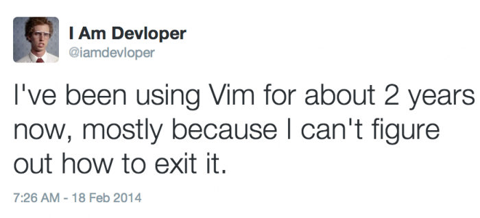
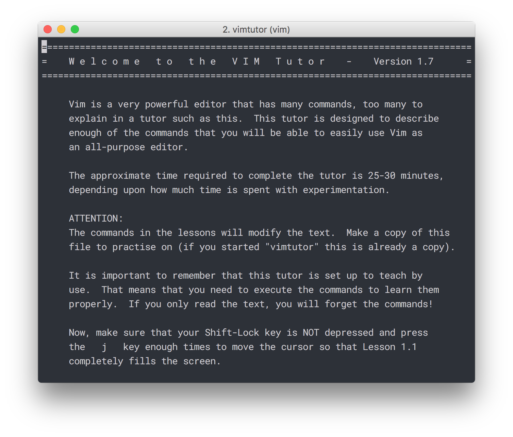
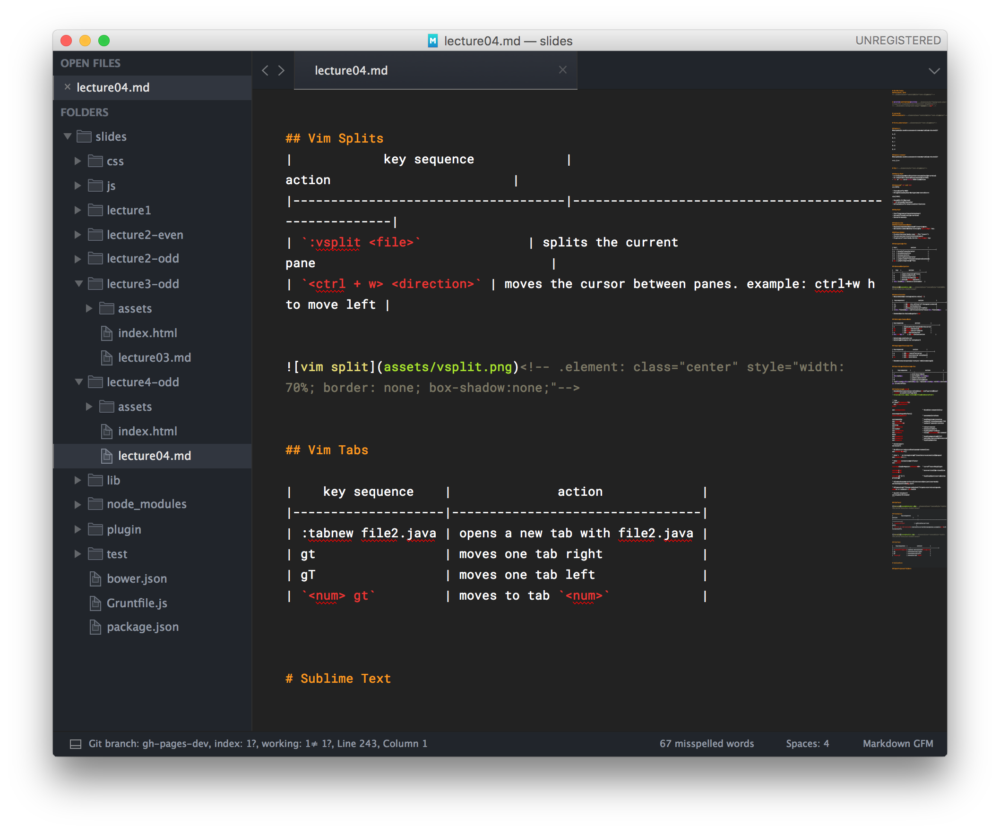
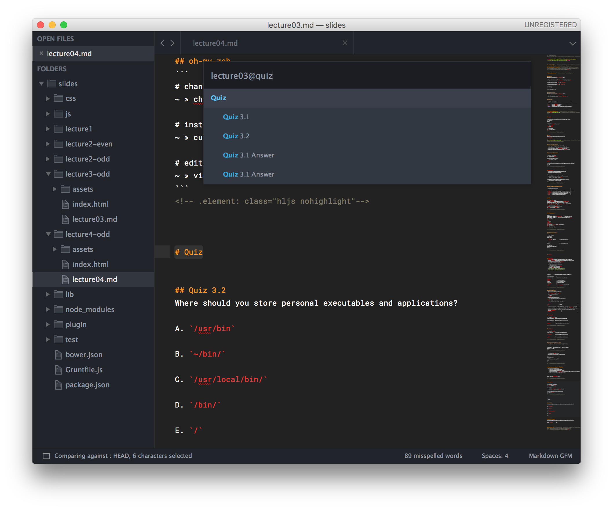
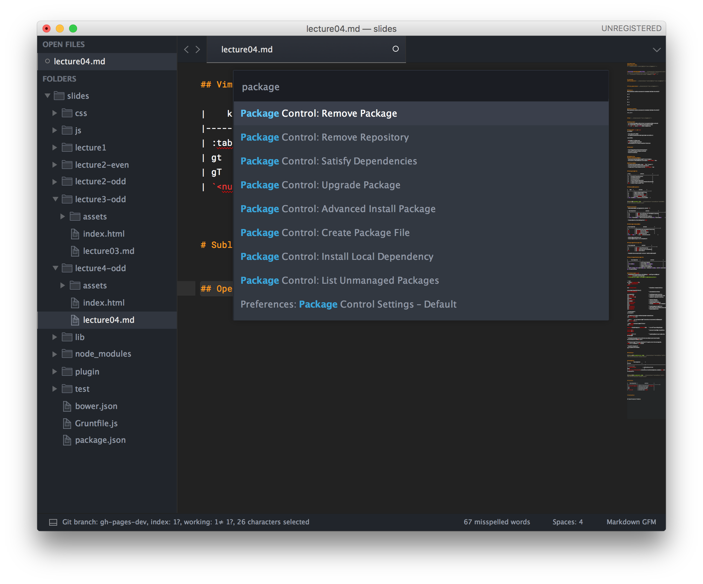
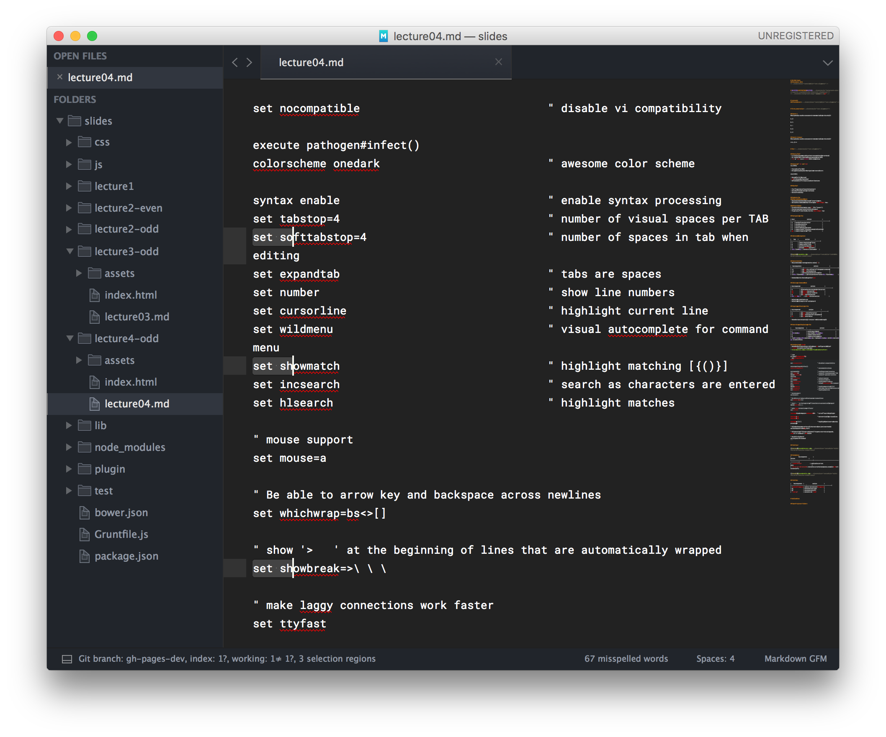
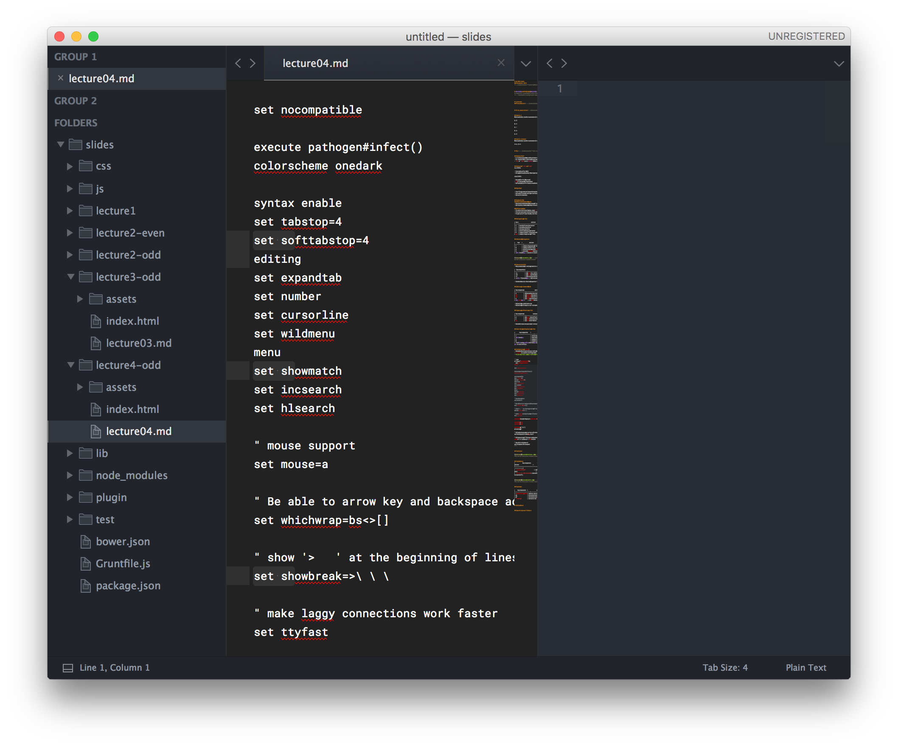

# CS 190: Tools
### October 18, 2016  
<!--.element: class="subtitle" style="text-align: center" -->


# &#127875; HAPPY OCTOBER &#127875;<!-- .element: style="background-color: #ff9b51; font-weight: bold; color: #f9f9f9; text-align: center;"-->
<!-- .slide: data-background-image="assets/spooky.gif" -->


## \~\~\~Hello World\~\~\~<!--.element: style="text-align: center;" -->
<!-- .element: class="center" style="width: 80%; border: none; box-shadow:none;"-->


# Lecture 4:
### Text Editors <!-- .element: class="subtitle" style="text-align: center" -->


# First, some review <!--.element: style="text-align: center"-->


## Quiz 4.1
What symbol is used to access environment variables in the shell?

A. $

B. %

C. !

D. &

E. #


## Quiz 4.1 Answer
What symbol is used to access environment variables in the shell?

** A. $ **


# Vim <!-- .element: style="text-align: center"-->


## What is Vim?
* A revolutionary text editor that runs completely in terminal
* It's helpful for editing files remotely (over SSH)
* `vi` or `vim` is on *every* UNIX-like machine


## History of `vi` and `vim`
vi (1976)

* Text editor for UNIX
* Brought visual keyboard navigation to text editors

vim (1991)

* Stands for Vi IMproved
* v8.0 released in September
* Default editor for many Linux distributions


## Why Vim?

* Your fingers never leave the keyboard
* Can edit files directly in terminal
* Can work remotely


## Modes in Vim
#### Normal (Command) Mode: 
* Keys execute commands instead of inserting text.
* Get back to command mode by hitting the `&lt; Esc&gt;` key.

#### Insert Mode:
* To enter the insert mode, type `i` (for "insert") 
* You can now insert text into the document
* To get out of insert mode, hit the `&lt; Esc&gt;` key


## Navigating in Vim

| key |                    action                   |
|-----|---------------------------------------------|
| h   | move left one character                     |
| j   | move down one line                          |
| k   | move up one line                            |
| l   | move right one character                    |
| G   | jump to end of file (notice capitalization) |
| gg  | jump to beginning of file                   |


## Advanced Navigation

|    key    |           action          |
|-----------|---------------------------|
| ^         | jump to beginning of line |
| $         | jump to end of line       |
| w         | move forward one (w)ord   |
| b         | move (b)ackward one word  |
| :&lt; line #&gt; | move to a line number     |


<!-- .element: class="center" style="width: 100%; border: none; box-shadow:none;"-->


## How to Exit Vim
* Many commands in vim begin with a colon (`:`)

|  key sequence  |                    action                    |
|----------------|----------------------------------------------|
| :q             | (q)uit vim, will warn if changes are unsaved |
| :q!            | (q)uit without saving                        |
| :w             | (w)rite (save) the current file              |
| :w &lt; file name&gt; | (w)rite (save) the file as &lt; file name&gt;       |

* Commands can be chained together: `:wq`


## Editing in Command Mode

| key sequence |                 action                 |
|--------------|----------------------------------------|
| x            | deletes the character under the cursor |
| dw           | (d)eletes the next (w)ord              |
| dd           | (d)eletes the current line             |
| u            | (u)ndo the last action                 |
| &lt; ctrl&gt; r     | (r)edo the last action                 |

* Deleting is similar to cut
* Deleting will copy to vim's clipboard


## Copying and Pasting in Vim

| key sequence |              action              |
|--------------|----------------------------------|
| p            | (p)aste text after cursor        |
| y            | (y)ank text into vim's clipboard |
| yy           | (y)ank entire line               |

* Remember: you can paste (p) text you've deleted using (d)


## Searching and Replacing in Vim

|       key sequence      |                     action                    |
|-------------------------|-----------------------------------------------|
| /                       | enters search mode                            |
| /&lt;text&gt;           | searches for &lt;text&gt;                     |
| n                       | jump to (n)ext match                          |
| N                       | jump to previous match                        |
| :%s/&lt;text&gt;/&lt;new text&gt;/g | replace &lt;text&gt; with &lt;new text&gt; in entire file |


## Vim Settings (.vimrc)
* Remember last week when we talked about rc configuration files?
* `.vimrc` is used to configure vim
* https://github.com/jay-hankins/dotfiles/blob/master/vimrc


```vim
if (has("termguicolors"))
  set termguicolors
endif

set nocompatible                            " disable vi compatibility

execute pathogen#infect()
colorscheme onedark                         " awesome color scheme

syntax enable                               " enable syntax processing
set tabstop=4                               " number of visual spaces per TAB
set softtabstop=4                           " number of spaces in tab when editing
set expandtab                               " tabs are spaces
set number                                  " show line numbers
set cursorline                              " highlight current line
set wildmenu                                " visual autocomplete for command menu
set showmatch                               " highlight matching [{()}]
set incsearch                               " search as characters are entered
set hlsearch                                " highlight matches

" mouse support
set mouse=a

" Be able to arrow key and backspace across newlines
set whichwrap=bs<>[]

" show '>   ' at the beginning of lines that are automatically wrapped
set showbreak=>\ \ \

" make laggy connections work faster
set ttyfast

nnoremap <leader><space> :nohlsearch<CR>    " turn off search highlight

nnoremap j gj                               " move vertically by visual line
nnoremap k gk

nnoremap gV `[v`]                           " highlight last inserted text by pressing gV

" Allow backspace to work on all characters (not just insert mode)
set backspace=indent,eol,start

" Allow saving of files as sudo when I forgot to start vim using sudo.
cmap w!! w !sudo tee > /dev/null %

" Use OS X clipboard
set clipboard=unnamed
```


## Vim Tutor

<!-- .element: class="center" style="width: 70%; border: none; box-shadow:none;"-->


## Vim Splits
|            key sequence            |                         action                        |
|------------------------------------|-------------------------------------------------------|
| `:vsplit <file>`              | splits the current pane                               |
| `<ctrl + w> <direction>` | moves the cursor between panes. example: ctrl+w h to move left |


<!-- .element: class="center" style="width: 70%; border: none; box-shadow:none;"-->


## Vim Tabs

|    key sequence    |              action             |
|--------------------|---------------------------------|
| :tabnew file2.java | opens a new tab with file2.java |
| gt                 | moves one tab right             |
| gT                 | moves one tab left              |
| `<num> gt`         | moves to tab `<num>`            |


# Sublime Text
<!-- .element: class="center" style="width: 25%; border: none; box-shadow:none;"-->


Open Projects / Folders:<!--.element: style="font-weight: 500; text-align: center;" -->
<!-- .element: class="center" style="width: 80%; border: none; box-shadow:none;"-->


Navigate Files:<!--.element: style="font-weight: 500; text-align: center;" -->
<!-- .element: class="center" style="width: 80%; border: none; box-shadow:none;"-->

Command + P "Filename"
<!--.element: style="text-align: center; margin-top: -30px;" -->


Finding in Files:<!--.element: style="font-weight: 500; text-align: center;" -->
<!-- .element: class="center" style="width: 80%; border: none; box-shadow:none;"-->

Command + P "@MethodName"
<!--.element: style="text-align: center; margin-top: -30px;" -->


##### [Package Control:](https://packagecontrol.io/)
<!--.element: style="font-weight: 500; text-align: center;" -->
<!-- .element: class="center" style="width: 80%; border: none; box-shadow:none;"-->

Command + Shift + P "Package Control"
<!--.element: style="text-align: center; margin-top: -30px;" -->


Multiple Cursors:<!--.element: style="font-weight: 500; text-align: center;" -->
<!-- .element: class="center" style="width: 80%; border: none; box-shadow:none;"-->

Command + Shift + L and Command + D
<!--.element: style="text-align: center; margin-top: -30px;" -->


* Command + Shift + L 
    * Adds a cursor to every line you currently have selected
* Command + D
    * Adds a cursor to the next instance of the current word and adds it to your selection


Split Panes:<!--.element: style="font-weight: 500; text-align: center;" -->
<!-- .element: class="center" style="width: 80%; border: none; box-shadow:none;"-->

Command + Option + &lt;Number Key&gt;
<!--.element: style="text-align: center; margin-top: -30px;" -->


# Atom
<!-- .element: class="center" style="width: 25%; border: none; box-shadow:none;"-->


## A modern competitor for Sublime Text
* Has virtually 1:1 feature compatibility with Sublime
* Built on web technologies by Github, using the [Electron](http://electron.atom.io/) library
* Atom is completely free, so goodbye annoying popups!


## Pros
* Like I said, completely free
* Built-in Markdown rendering (web technologies are neat-o)
* Open source, modular, and hackable with a large community for support
* Built by Github, so very tightly integrated with source control packages


## Cons
* Performance and battery usage take a big hit (web technologies are neat-o)
* Not as mature as Sublime


## Verdict
Try them both and use what you like!


# Quiz


## Quiz 4.2
How would you delete the current line in vim if you are in command mode?

A. dw

B. yy

C. dd

D. dx


## Quiz 4.2 Answer
What symbol is used to access environment variables in the shell?

** C. dd **


# Announcements


## Technical Interview Prep Night
* Undergraduate Board for Computer Science
* Get interview practice and hear from people that have had internships
* Tonight (October 18), 6:00 PM EDT, Lawson 1142
* [Facebook Event!](https://www.facebook.com/events/2145639872328109)


## Fireside Chat with Samsung

* Hear from Chris Lee, Samsung Mobile tech scout 
* Will include information on Samsung technology and internships
* Tomorrow (October 19), 7:00 PM EDT, The Anvil
* [Facebook Event!](https://www.facebook.com/events/179696709144000)
