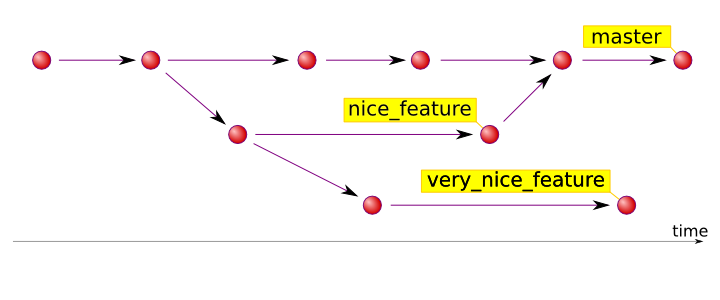

# CS 190: Tools
### October 25, 2016  
<!--.element: class="subtitle" style="text-align: center" -->


## Lecture 5<!--.element: style="text-align: center;" -->
### git ready <!--.element: style="text-align: center;" -->
<!-- .element: class="center" style="width: 80%; border: none; box-shadow:none;"-->


# First, some review <!--.element: style="text-align: center"-->


## Quiz 5.1
What is your current system for working on the same code base in a group project?

A. Dropbox or other sync tool

B. Email

C. We work on the same computer

D. Git or some other source control (yay!)

E. I’ve never worked on a group programming project
<br>

<span>Forgot your i>clicker? Sign in: https://purdueusb.com/cs190/signin</span>
<!--.element: style="font-size: 16pt" -->


# Lecture 5:
### Basics of Git <!-- .element: class="subtitle" style="text-align: center" -->


# GitHub and git <!-- .element: style="text-align: center"-->


## What is GitHub?
* GitHub is a place to put code
* GitHub is like a programmer's portfolio
* Hackathons (even BoilerMake) usually require a GitHub account
* GitHub uses git


## Source Control
#### (aka Revision Control or Version Control)
* History of changes in code
* Great for teams
* Sync code across machines
* Almost impossible to lose code
* Can restore any previous state


## Definitions

* A `commit` is a snapshot of your files
* A `repository` (aka `repo`) is a collection of commmits


## Get started

Run `git init` to create an empty repo

```
~ » git init
Initialized empty Git repository in /Users/mkausas/scratch/cool_project/.git/
~ git:(master) » git status
On branch master

Initial commit

nothing to commit (create/copy files and use "git add" to track)
```
<!-- .element: class="hljs nohighlight"-->


## New file handling

By default no files are `tracked` by git

```
~ » git status
On branch master

Initial commit

Untracked files:
  (use "git add <file>..." to include in what will be committed)
	CoolCode.java
nothing added to commit but untracked files present (use "git add" to track)
```
<!-- .element: class="hljs nohighlight"-->


## Adding stuff

Tell git to `track` a file by `adding` it

```
~ » git add CoolCode.java
~ » git status
On branch master
Initial commit

Changes to be committed:
  (use "git rm --cached <file>..." to unstage)

new file:   CoolCode.java
```
<!-- .element: class="hljs nohighlight"-->


## Committing changes

Bundling changes together and saving them
```
~ » git commit -m “initial commit”
[master (root-commit) 4127eaa] initial commit
 1 file changed,48 insertions(+), 0 deletions(-)
 create mode 100644 CoolCode.java
~ » git status
Initial commit
On branch master
nothing to commit, working directory clean
Initial commit
```
<!-- .element: class="hljs nohighlight"-->


<!-- .element: class="center"-->


## Checking the history

See what commits have happened
```
~ » git log
commit 4127eaa6bff8e045d11707c91262526a7d7e414a
Author: Marty Kausas <mkausas@gmail.com>
Date:   Tue Oct 28 17:40:25 2014 -0400

    initial commit
```
<!-- .element: class="hljs nohighlight"-->


## Looking at old commits

Examine diffs from old commits
```
~ » git show fbda9a0
commit fbda9a0a36216cfa89dcc79561e9c88e3d2d322b
Author: Marty Kausas <mkausas@gmail.com>
Date:   Tue Oct 28 15:31:41 2014 -0400
	added vim temp files to gitignore
diff --git a/.gitignore b/.gitignore
@@ -1 +1,2 @@
 *.class
+*.swp
```
<!-- .element: class="hljs nohighlight"-->


## Looking at old commits (cont.)

Examine diffs from old commits
```
~ » git show fbda9a0:compile.sh
#!/bin/bash
# clean
rm -rf build/
# compile
mkdir -p build/classes
javac src/* -d build/classes
```


## When you f#@% things up

Reversing old commits
```
~ » git revert fbda9a0
1 Revert "added vim temp files to gitignore"
2 
3 This reverts commit fbda9a0a36216cfa89dcc79561e9c88e3d2d322b.
4 
5 # Please enter the commit message for your changes. Lines starting
6 # with '#' will be ignored, and an empty message aborts the commit.
7 # On branch master
8 # Changes to be committed:
9 #       modified:   .gitignore
```
<!-- .element: class="hljs nohighlight"-->


## Annoying class files

.class files suck (with regards to git at least)
```
~ » git status
On branch master
Untracked files:
  (use "git add <file>..." to include in what will be committed)
	CoolCode.class

nothing added to commit but untracked files present (use "git add" to track)
```
<!-- .element: class="hljs nohighlight"-->


## .gitignore to the rescue!

We can tell git to ignore certain files
```
~ » echo "*.class" > .gitignore
~ » git status
On branch master
Untracked files:
  (use "git add <file>..." to include in what will be committed)
	.gitignore

nothing added to commit but untracked files present (use "git add" to track)
```
<!-- .element: class="hljs nohighlight"-->


## .gitconfig: make a badass workflow!

* .gitconfig files can be found locally or globally (in home directory)
* Largely matter of preference
```
  ...
  4 [color]
  5     ui = true
 12 [alias]
 13     st = status
 14     lg = log --graph --oneline
 15     co = checkout
 16     br = checkout -b
 17     p = push origin
 18     a = add .
 19     c = commit -m
 20     m = merge --no-ff
 21     dt = difftool
```
<!-- .element: class="hljs nohighlight"-->


## Using branches

* Branching is a good way to organize features
* Use branching if you are not sure whether or not you will use code
* Use branching if you are working with others
* Use branching for distinct features
```
~ » git checkout -b new_branch
Switched to a new branch 'new_branch'
```
<!-- .element: class="hljs nohighlight"-->


## Branching example (CS project)
<!-- .element: class="center"-->


## Commands to get started
|  																	|                               |
|-------------------------------------------------------------------|-------------------------------|
| To create or “initialize” a git repo in the current directory. 	| git init 						|
| Tell git to “track” a file (initially add it) 					| git add file1 				| 
| *Changes are made to file1* 										| 								|
| Inspect changes 													| git diff 						| 
| Add changes to a file to the staging area 						| git add file1 				|
| Create a commit with currently staged changes 					| git commit -m “adds file1” 	|


## Commands to get started (cont)
|        						|					|
|-------------------------------|-------------------|
| Check status of repository 	| git status 		|
| Display the commit log 		| git log 			| 
| Show a certain commit 		| git show 7be88d2 	|


## Advanced Topics (Explore on your own)
|        							|									|
|-----------------------------------|-----------------------------------|
| Create a branch 					| git branch new_branch_name 		|
| Switch to a different branch 		| git checkout other_branch 		| 
| Create and switch to a new branch | git checkout -b my_new_branch		|


## Other Notes
* git "just works" 90% of the time
* It's the industry standard
* Tips: 
	* Commit early, commit often
	* Use commits properly (bundle related changes)
	* Don't commit non-working code (use branches if you want to do this)


# Quiz <!--.element: style="text-align: center"-->


## Quiz 5.2
Which of the following shows previous commits?

A. git status

B. git log

C. git add 

D. git commit

E. ls


# Random Useful Shit <!--.element: style="text-align: center"-->


## Quiz 5.3
Have you found the extra content we’ve included at the end of our lectures (how to get internships, how to career fair, RUS) to be helpful?

A. Yes

B. No

<span>Forgot your i>clicker? Sign in (only once): https://purdueusb.com/cs190/signin</span>
<!--.element: style="font-size: 16pt" -->


<!-- .slide: data-background-image="assets/giphy.gif" -->
