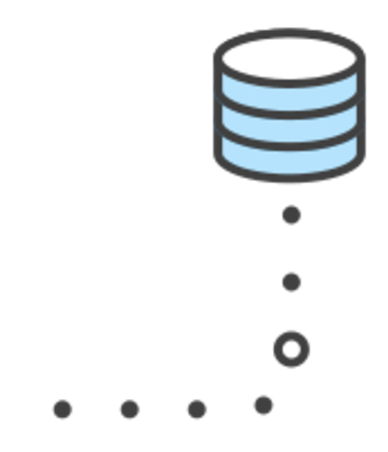

# CS190: Tools
### November 8, 2016
<!--.element: class="subtitle" style="text-align: center" -->


<iframe src="https://drive.google.com/file/d/0B6T9Y1awPtf7LTNnOU0zYzVEekU/preview" width="100%" height="550"></iframe>


# Lecture 6:
### Collaborating with git <!-- .element: class="subtitle" style="text-align: center" -->
### a.k.a. (git remotes)<!-- .element: class="subtitle" style="text-align: center; font-size: 24pt" -->


# But first! Let's review ;) <!--.element style="text-align: center"-->


## Quiz 6.1
What is Github?

A. A piece of software that sends code to other developers.

B. A website that provides a frontend for git repositories with extra features.

C. A dating website for programmers.

D. A new version of git.
<br>

<span>Forgot your i>clicker? Sign in: https://purdueusb.com/cs190/signin</span>
<!--.element: style="font-size: 16pt" -->


## Quiz 6.1 Answer
What is Github?

A. A piece of software that sends code to other developers.

** B. A website that provides a frontend for git repositories with extra features. **

C. A dating website for programmers.

D. A new version of git.
<br>

<span>Forgot your i>clicker? Sign in: https://purdueusb.com/cs190/signin</span>
<!--.element: style="font-size: 16pt" -->


# Reminders: Local git basics <!-- .element: style="text-align: center"-->


### Initialize
```
~ » git init
Initialized empty Git repository in /Users/matthew/cool_project/.git/
~ git:(master) » git status
On branch master

Initial commit

nothing to commit (create/copy files and use "git add" to track)
```
<!-- .element: class="hljs nohighlight"-->


### Add (or track)
```
~ git:(master) » git status
On branch master

Initial commit

Untracked files:
  (use "git add <file>..." to include in what will be committed)
  CoolCode.java
nothing added to commit but untracked files present (use "git add" to track)
~ git:(master) » git add CoolCode.java
~ git:(master) » git status
On branch master
Initial commit

Changes to be committed:
  (use "git rm --cached <file>..." to unstage)

new file:   CoolCode.java
```
<!-- .element: class="hljs nohighlight"-->


### Commit
```
~ git:(master) » git commit -m “Add some cool code”
[master (root-commit) 4127eaa] Add some cool code
 1 file changed,48 insertions(+), 0 deletions(-)
 create mode 100644 CoolCode.java
~ git:(master) » git status
On branch master
nothing to commit, working directory clean
```
<!-- .element: class="hljs nohighlight"-->


### Workflow
New files in the **working directory** are **add**ed to the **staging area**, then **commit**ted to the **repository**. The repository represents a history of all the commits which can be traversed forward (to the current state of the project) or backward (all the way to the initial commit).

 <!-- .element: class="center" style="width: 80%; border: none; box-shadow:none;"-->


# But...
### What comes next? <!-- .element: style="text-align: center" -->


# Remotes!

- centralize your code base
- allow multiple people to work on a project
- backup changes
- "crowdfund" your bug fixes


### What are they?
Remotes are just a copy of your local git repo stored somewhere else. One git repository can have many remotes. Repositories on Github (or Bitbucket) represent a remote.

 <!-- .element: style="width: 70%; border: none; box-shadow:none; margin-right: -100px;"-->  <!-- .element: style="width: 20%; border: none; box-shadow:none"-->


### Add a remote, then push
```
~ git:(master) » git remote add origin https://github.com/jay-hankins/cool_project.git
~ git:(master) » git push --set-upstream origin master
Counting objects: 3, done.
Delta compression using up to 8 threads.
Compressing objects: 100% (2/2), done.
Writing objects: 100% (3/3), 256 bytes | 0 bytes/s, done.
Total 3 (delta 0), reused 0 (delta 0)
To https://github.com/jay-hankins/cool_project.git
 * [new branch]      master -> master
Branch master set up to track remote branch master from origin.
```
<!-- .element: class="hljs nohighlight"-->


### Check your remotes
```
~ git:(master) » git remote -v
origin  https://github.com/jay-hankins/cool_project.git (fetch)
origin  https://github.com/jay-hankins/cool_project.git (push)
```
<!-- .element: class="hljs nohighlight"-->

The remote gets one entry for fetching (getting changes) and pushing (sending changes).


### Pull new changes
* used to get the latest changes from the remote to your local machine

```
~ git:(master) » git pull
remote: Counting objects: 22, done.
remote: Compressing objects: 100% (22/22), done.
remote: Total 22 (delta 8), reused 0 (delta 0), pack-reused 0
Unpacking objects: 100% (22/22), done.
From https://github.com/jay-hankins/cool_project
   91f8ed9..c7281f6  master     -> origin/master
Updating 91f8ed9..c7281f6
Fast-forward
 cool_code.java   | 10 +++++-----
1 files changed, 5 insertions(+), 5 deletions(-)
```
<!-- .element: class="hljs nohighlight"-->


### Clone a remote
* used to save a repo to your local machine

```
~ » git clone https://github.com/jay-hankins/cool_project.git
Cloning into 'cool_project'...
remote: Counting objects: 795, done.
remote: Total 795 (delta 0), reused 0 (delta 0), pack-reused 795
Receiving objects: 100% (795/795), 668.07 KiB | 0 bytes/s, done.
Resolving deltas: 100% (318/318), done.
~ » cd cool_project
~ git:(master) » git status
On branch master

Initial commit

nothing to commit (create/copy files and use "git add" to track)
```
<!-- .element: class="hljs nohighlight"-->


### Branches
A repository can contain multiple related chains of commits, called branches.
The `master` branch contains the main body of production code, and is the default.
Other branches can serve many purposes:
- development code
- github-pages
- testing a small change
- separating changes into individual features


### Remote branches
Remotes get their own copies of branches (`master` vs `origin/master`), and local branches and remote branches might look very different. 

```
~ git:(master) » git branch --all
dev
gh-pages
master
remotes/origin/bugfix
remotes/origin/dev
remotes/origin/feature1
remotes/origin/feature2
remotes/origin/gh-pages
remotes/origin/master
remotes/origin/testing
```
<!-- .element: class="hljs nohighlight"-->


### Merging
Eventually, most (not all) branches should be incorporated back into the `master` branch. Merging two branches will join them with a single commit, assuming there are no conflicts between them.

<!-- .element: class="center" style="width: 80%; border: none; box-shadow:none;"-->


### Revisiting `git pull`
When we `pull` from a remote, we're actually doing a two step process.
1. `fetch` the most recent commit history from the remote for the current branch.
2. `merge` the remote branch with the local branch.


### Merge conflicts
What if we try to push to a remote that has changes that we don't?
```
~ git:(master) » git push origin master
  ![rejected]     master -> master (fetch first)
error: failed to push some refs to 'https://github.com/jay-hankins/cool_project.git'
hint: Updates were rejected because the remote contains work that you do
hint: not have locally. This is usually caused by another repository pushing
hint: to the same ref. You may want to first integrate the remote changes
hint: (e.g., 'git pull ...') before pushing again.
hint: See the 'Note about fast-forwards' in 'git push --help' for details.
```
<!-- .element: class="hljs nohighlight"-->
As git tells us, we need to get the remote changes and integrate them.


### Resolving merge conflicts
```
~ git:(master) » git pull origin master
...
From https://github.com/scottopell/cool_project
 * branch            master     -> FETCH_HEAD
   ebd84d0..d9d1832  master     -> origin/master
Auto-merging README.md
CONFLICT (content): Merge conflict in README.md
Automatic merge failed; fix conflicts and then commit the result.
```
<!-- .element: class="hljs nohighlight"-->


```
~ git:(master) » git status
On branch master
Your branch and 'origin/master' have diverged,
and have 1 and 1 different commit each, respectively.
  (use "git pull" to merge the remote branch into yours)
You have unmerged paths.
  (fix conflicts and run "git commit")
Unmerged paths:
  (use "git add <file>..." to mark resolution)
  both modified:      README.md
```
<!-- .element: class="hljs nohighlight"-->


```
~ git:(master) » cat README.md
<<<<< HEAD:README.md
Authors: Matt
========
Authors: Jay
>>>>>> origin/master:README.md
```
<!-- .element: class="hljs nohighlight"-->


### Avoiding merge conflicts
- Pull often
- Avoid multiple people working on a single feature or area at once
- Divide work into branches


### Is it magic??
Unfortunately, no. git just uses a hidden folder (`.git/`) to keep track of all the information that changes. It can't save you from yourself, so be careful and commit often.


### ...and that's git. Well, some of it.
- git is a tool to keep track of changes we make to code and share that code with other people.
- Files are added to the staging area and then committed to the repository.
- Remotes gives us a way to keep our code backed up and centralize a team project.
- Branches let us organize code into features and can be merged together if they're compatible.


### Why does it matter?
- Much like the terminal, git is an industry standard.
- It lets you show off things a resume just doesn't work for.
- Maintain order within and between your projects.
- Work with a team.


# Quiz <!--.element: style="text-align: center"-->


## Quiz 6.2
What is a remote?

A. What you use to control your TV

B. A central copy of a git repo

C. A sequence of commits

D. The contents of a commit


## Quiz 6.2 Answer
What is a remote?

A. What you use to control your TV

**B. A central copy of a git repo**

C. A sequence of commits

D. The contents of a commit


<!-- .slide: data-background-image="assets/Battleship.svg" -->
