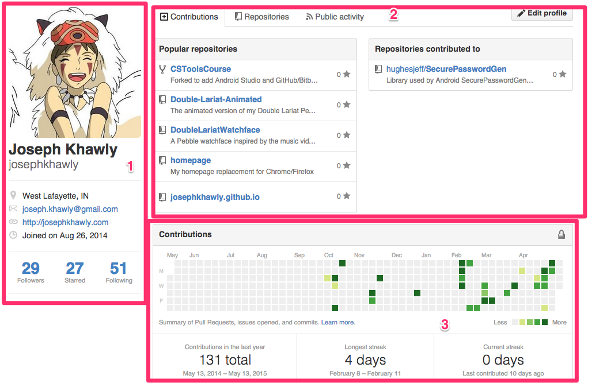

# GitHub
Copyright 2015 Joseph Khawly

## Why would I use this?

In CS, the stuff that matters most is what you make, so you want a place to store those things for friends and recruiters to see. GitHub does just that. Just make sure to include your URL on your resume (or wear [this t-shirt](https://github.myshopify.com/products/github-username-shirt)) so that people can find it. You can also search GitHub and find some great programs that you didn't even know you wanted, like [this](https://github.com/nvbn/thefuck).

## Student developer pack

When you sign up for Github (or if you're already signed up), you can get access to the [student developer pack](https://education.github.com/pack), which gives you 5 free private repositories and a load of other goodies for as long as you're a student.

## Your Profile
Let's take a look at what the profile page looks like:



1. **The sidebar** - This contains some basic info such as your name, email address, website, and location.
2. **Tabs** - The contributions tab is shown everytime some visits a profile, and it displays your popular repositories and a graph of your contributions. The repositories tab will show all of the repositories you've created and forked. The public activity tab shows a feed of all your recent commits, forks, etc. When someone follows you, this will show up in their news feed.
3. **Contribution graph** - A display of how many contributions you've made on each day of the year. It also show your total contributions and your longest streak of consecutive ones.

### Helpful Advice
- Try to use a professional looking photo of yourself as your avatar (unlike me).
- Definitely include your email and personal website. If you don't have a website, [GitHub Pages](https://pages.github.com/) can help you set one up.
- Don't worry about how many followers you have or how many stars your repos have. That stuff really doesn't matter in the long run.

## Creating a Repository
1. Click on the '+' button next to your username.
2. Give the repository a name and click "Create Repository".
3. Copy the url and add the repo as a remote to an exising one on your computer.
	
	```
	git remote add origin <URL>
	```
4. After you make a commit, push it to the remote.

 	```
 	git push -u origin master
 	```

## Forking and Cloning
Forking reposiories allows you to contribute them by submitting your changes through a pull request.

1. Find the repo for some project you want to contribute to.
2. Click the "fork" button in the top right corner.
3. Clone the repo to your computer.

	```
	git clone <repo>
	```
	
## Bitbucket
[Bitbucket](https://bitbucket.org/) is an alternative to GitHub. The main difference between the two is that Bitbucket gives you unlimited private repositories, whereas with GitHub you have to pay a monthly fee for them.